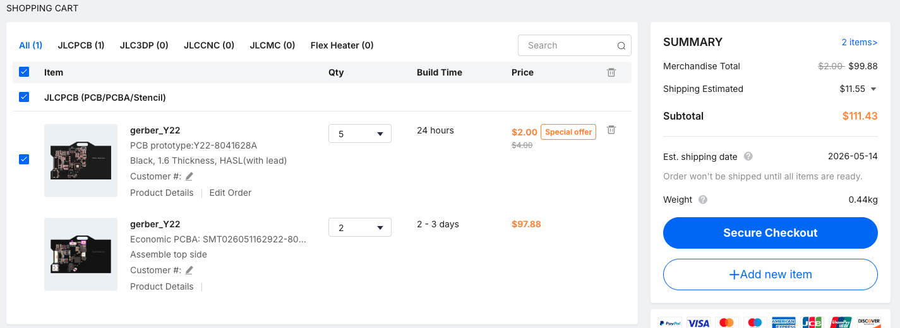

# BOM
### Note that this is for ~2 PCBA and some parts have min amount required

---

|	Comment	|	Designator	|	Footprint	|	JLCPCB Part #	|	Quantity	|	Total Cost	|
|	-----	|	-------	|	-------	|	-------	|	----	|	-------	|
|	AOTA-B201610S3R3-101-T	|	L1	|	IND-SMD_L2.0-W1.6_AOTA-B201610S3R3-101-T	|	C42411119	|	1	|	$1.4160	|
|	0603WAF220KT5E	|	R10,R11	|	R0603	|	C22939	|	2	|	$0.0108	|
|	33	|	R1	|	R_0402_1005Metric	|	C25105	|	1	|	$0.0018	|
|	LMK212BJ226MG-T	|	C24,C30,C35	|	C0805	|	C92814	|	3	|	$0.3430	|
|	CL10C100JB8NNNC	|	C38	|	C0603	|	C1634	|	1	|	$0.0106	|
|	RP2350A	|	U1	|	QFN-60-1EP_7x7mm_P0.4mm_EP3.4x3.4mm	|	C42411118	|	1	|	$2.5154	|
|	CL21A475KAQNNNE	|	C19,C20,C21,C22,C23,C25,C26,C27,C29	|	C0805	|	C1779	|	9	|	$0.2646	|
|	0603WAF100KT5E	|	R15,R16	|	R0603	|	C22936	|	2	|	$0.0088	|
|	560k	|	R19,R21	|	R_0805_2012Metric	|	C1404	|	2	|	$0.0380	|
|	0402WGF1002TCE	|	R13,R14	|	R0402	|	C25744	|	2	|	$0.0052	|
|	0	|	R6	|	R_0402_1005Metric	|	C17168	|	1	|	$0.0016	|
|	W25Q128JVS	|	U4	|	SOIC-8_5.3x5.3mm_P1.27mm	|	C97521	|	1	|	$4.9376	|
|	CY43-10UH	|	U8	|	IND-SMD_L4.5-W4.0	|	C2929419	|	1	|	$0.7940	|
|	XFL4020-102MEC	|	L2	|	IND-SMD_L4.0-W4.0_XFL4020-102MEB	|	C5355380	|	1	|	$2.2874	|
|	100n	|	C6,C8,C9,C10,C11,C12,C13,C14,C15,C16	|	C_0402_1005Metric	|	C1525	|	10	|	$0.0300	|
|	4.7u	|	C1,C2,C3,C7	|	C_0402_1005Metric	|	C23687	|	4	|	$0.3744	|
|	2k	|	R8	|	R_0402_1005Metric	|	C4109	|	1	|	$0.0016	|
|	200k	|	R20	|	R_0201_0603Metric	|	C49653632	|	1	|	$0.0100	|
|	FPC-05FB-24PH20	|	FPC1	|	FPC-SMD_24P-P0.50_FPC-05FB-24PH20	|	C2856831	|	1	|	$0.3974	|
|	YZA-009	|	U5	|	SW-SMD_YZA-009	|	C49108621	|	1	|	$0.0855	|
|	NCP1117-3.3_SOT223	|	U2	|	SOT-223-3_TabPin2	|	C6186	|	1	|	$0.4258	|
|	15p	|	C17,C18	|	C_0402_1005Metric	|	C1548	|	2	|	$0.0048	|
|	SS14	|	D4,D5,D6	|	SMA_L4.2-W2.6-LS5.0-RD_1	|	C2480	|	3	|	$0.1008	|
|	1M	|	R18	|	R_0603_1608Metric	|	C22935	|	1	|	$0.0030	|
|	1k	|	R9,R12	|	R_0402_1005Metric	|	C11702	|	2	|	$0.0040	|
|	SM03B-SRSS-TB	|	U7	|	CONN-SMD_SM03B-SRSS-TB-LF-SN-P	|	C160403	|	1	|	$1.0730	|
|	GT-USB-7010ASV	|	U3	|	USB-C-SMD_G-SWITCH_GT-USB-7010ASV	|	C2988369	|	1	|	$0.1732	|
|	ABM8-272-T3_C20625731	|	U6	|	CRYSTAL-SMD_4P-L3.2-W2.5-BL	|	C20625731	|	1	|	$1.4610	|
|	AO3400A	|	Q1	|	SOT-23-3_L2.9-W1.3-P1.90-LS2.4-BR	|	C20917	|	1	|	$0.1646	|
|	5.1k	|	R2,R3	|	R_0402_1005Metric	|	C25905	|	2	|	$0.0036	|
|	10k	|	R17	|	R_0603_1608Metric	|	C15401	|	1	|	$0.0220	|
|	EMK212BJ106KG-T	|	C28,C36	|	C0805	|	C87157	|	2	|	$0.4060	|
|	MST-12D18G2SMDSLIDESWITCH	|	SW1	|	SW-SMD_3P-L9.1-W3.5-P2.50_MST-12D18G2	|	C49023765	|	1	|	$0.3945	|
|	CL10A105KB8NNNC	|	C31,C32,C33,C34	|	C0603	|	C15849	|	4	|	$0.0608	|
|	BQ24040DSQR	|	U9	|	WSON-10_L2.0-W2.0-P0.40-BL-EP	|	C81080	|	1	|	$1.7075	|
|	10u	|	C4,C5	|	C_0805_2012Metric	|	C15850	|	2	|	$0.0824	|
|	CC0402KRX5R9BB104	|	C37	|	C0402	|	C307331	|	1	|	$0.0092	|
|	TPS63060DSCR	|	U10	|	WSON-10_L3.0-W3.0-P0.50-BL-EP-A	|	C48567	|	1	|	$3.7170	|
|	B2B-PH-K-S	|	CN2	|	CONN-TH_B2B-PH-K-S	|	C5251182	|	1	|	$1.2112	|
|	27	|	R4,R5	|	R_0402_1005Metric	|	C25100	|	2	|	$0.0160	|
|		|		|		|		|		|		|

