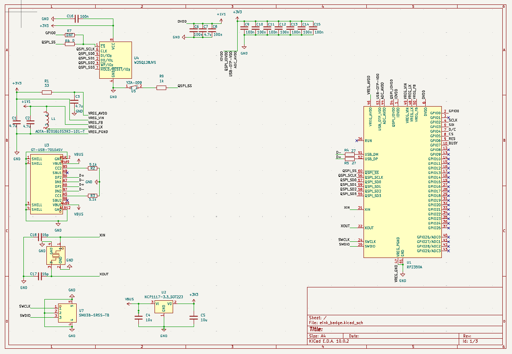
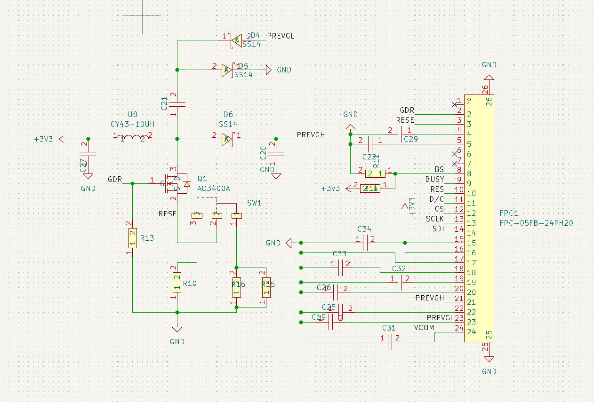
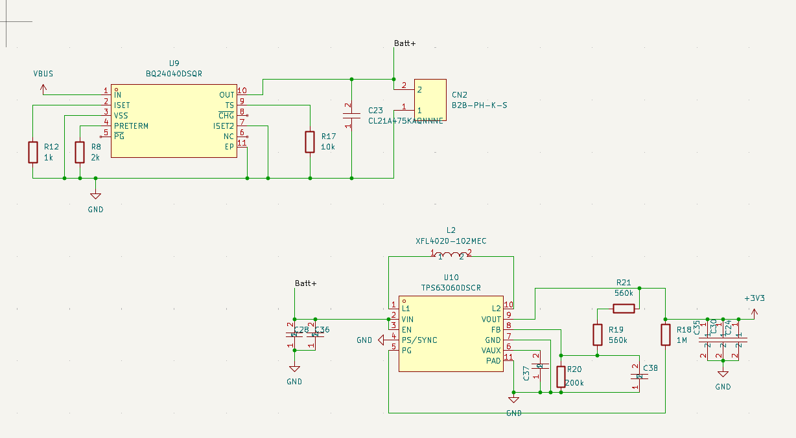
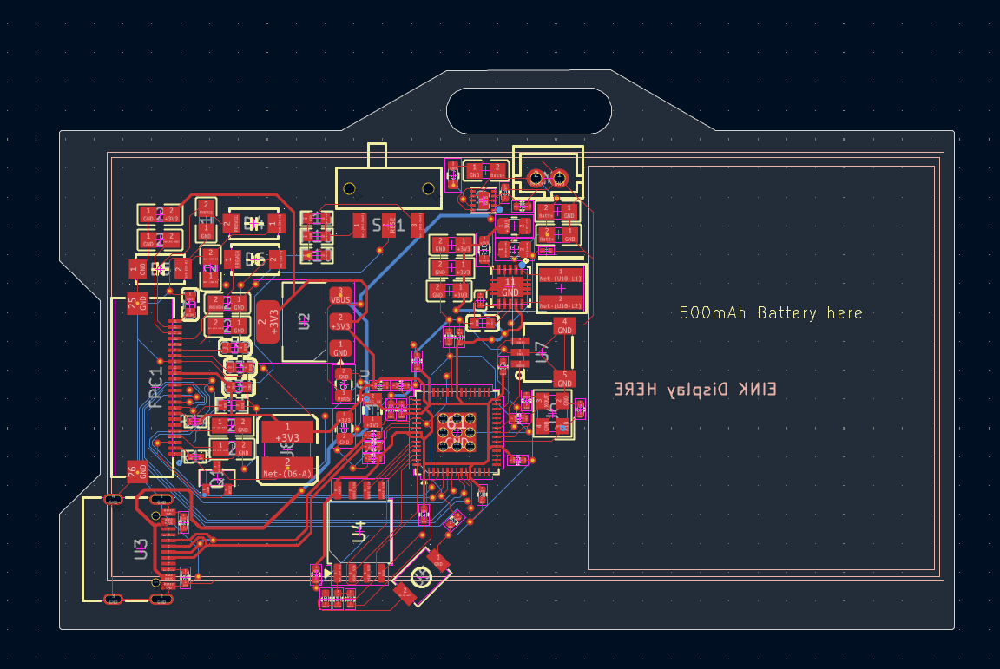

# E-Ink-Badge
I made a Eink display badge powered by the rp2350A inspired by the github universe conference badge from 2024

    
    

(Renders made on Fusion 360)

    

        
        
        
    

    

        
    

# Features
- Currently I hvae made no software for it but I may try to adapt the badger software from the conference badge
- RP2350A
- 16MB of flash
- Battery Management
- E-INK Display Support over SPI

# Getting Started
[Here](./GET_STARTED.md)

# PCB BOM
[Here](./PCB_BOM.md)

# BOM ( Not PCB BOM from /production )
| Item | Quantity | Cost ($) | Link | 
|-----|----------|-----|---------|
| EInk Display | x1 | $6.30 | [here](https://buyepaper.com/products/e-ink-display-high-resolution-gdey0266t90h?VariantsId=10607) |
| Battery 3.7V / 500mAh | x1 | $8.50 | [here](https://thepihut.com/products/500mah-3-7v-lipo-battery) |
| PCB | x5 | $2-$4 | [JLCPCB](https://jlcpcb.com/) |
| PCBA | x2 | $97.88 | [JLCPCB](https://jlcpcb.com/) |