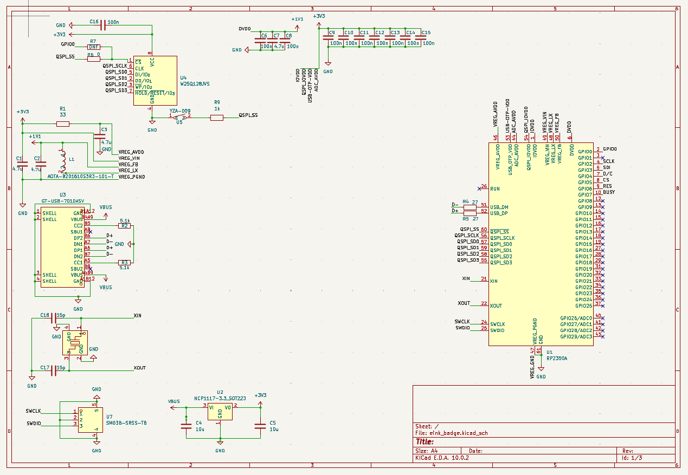
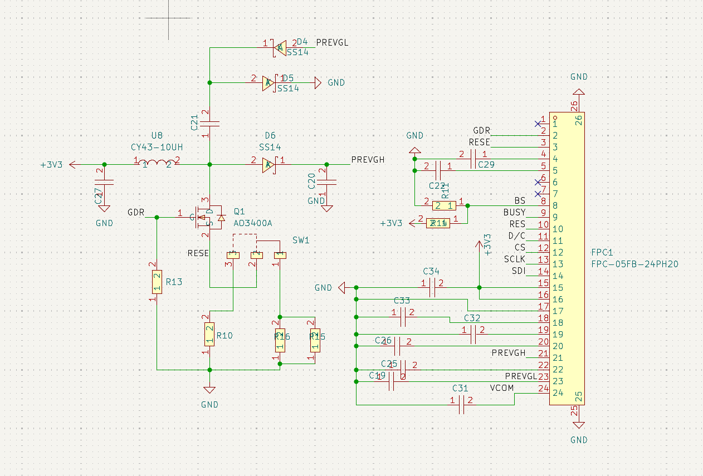
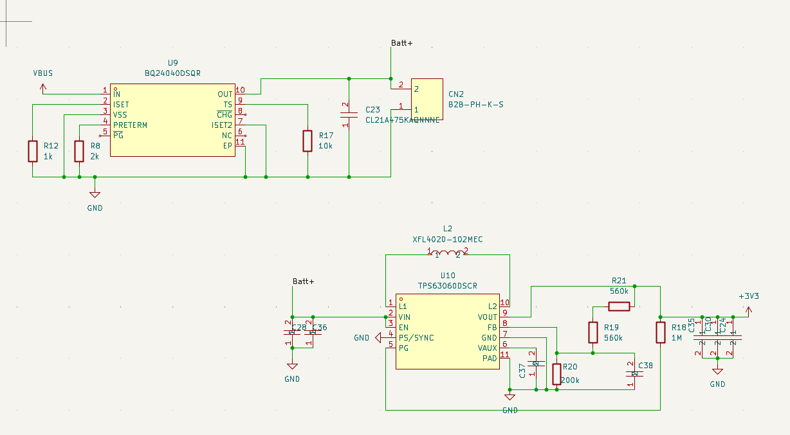
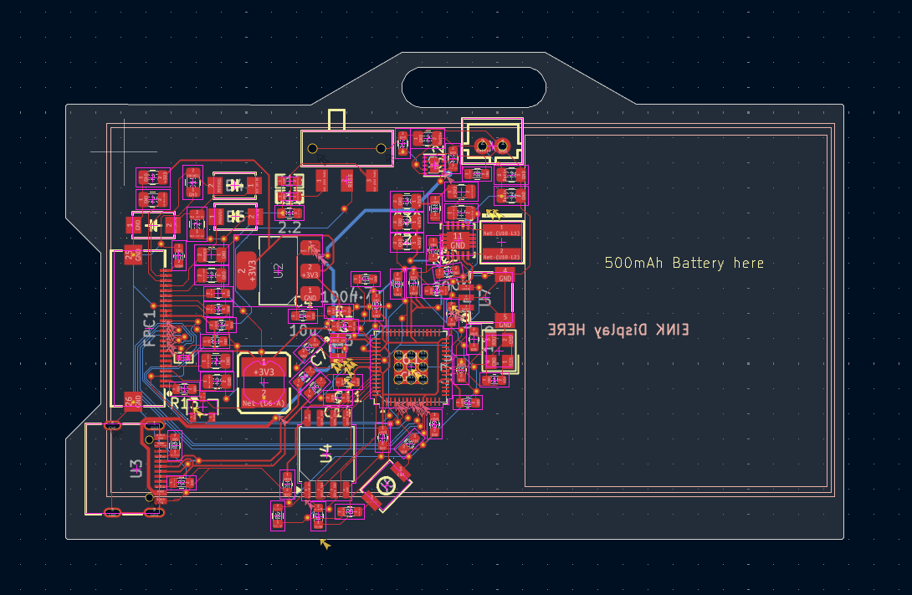

# E-Ink Badge

A DIY Custom Designed, Monochrome, E-Ink display badge powered by the RP2350A, inspired by the GitHub Universe 2024 conference badge.
~Kinda wanted to see how many words I could describe it with. 

    
    

*(Renders made in Fusion 360)*

    

        
        
        
    

    

        
    

## Features

- **MCU:** The mighty RP2350A I wish the RP2354A were in stock though
- **Flash:** 16MB onboard but do I want it to remember?
- **Power:** Integrated battery management for a single-cell LiPo, does it charge idk
- **Display:** E-Ink support over SPI, this was painful for part selection
- **Software:** No dedicated firmware/software yet — I'm considering adapting the [Badger 2040](https://github.com/pimoroni/badger2040) software from the GitHub Universe conference badge as a starting point, don't have the time for it

## Build Guide

This board has some fine-pitch and hand-soldering-unfriendly parts (the RP2350A and the E-Ink display's FPC connector), so I'd recommend using a **PCBA service** for the main board rather than hand-soldering it yourself. I know I wouldn't I have tried and failed, mainly cuz I dont have a hotplate.

Most components will already be populated(i liked this fancy word better than `placed`) by the assembly service — you'll only need to install the **battery** and the **display** yourself:

**Bring your own adhesive, please**
~ Not on BOM cuz not required for functionality

1. **Prepare the battery connector:** Trim the battery connector's legs slightly so they don't press against the back of the display once everything is assembled.
2. **Mount the battery:** Apply adhesive to the marked area on the PCB and stick the battery down.
3. **Connect the battery:** Plug the battery cable into the battery connector on the PCB.
4. **Mount the display:** Apply adhesive to the marked area on the front of the PCB and attach the E-Ink display. 
5. **Connect the display cable:** Route the ribbon cable through the indentation/slot in the PCB. Open the FPC connector's clamp arm, insert the ribbon cable, then press the clamp lever back down to lock it in place.

"That's it — the badge is fully assembled", I'd like to say, whether the firmware actually works, is what I'd like to know.

For getting started with software, I'd recommend flashing **CircuitPython**, as it's the easiest way to get up and running. Also have some demo firmware included in this repo, though it's untested/may not work out of the box.

## Firmware

I have some basic firmware in this repo. If you'd like to write your own, here are the SPI pin mappings for the display connection:

### SPI Pinout

| Signal | GPIO |
|--------|------|
| SCLK (Clock)      | GPIO 2 |
| SDI (MOSI/Data)   | GPIO 3 |
| D/C (Data/Command)| GPIO 4 |
| CS (Chip Select)  | GPIO 5 |
| RES (Reset)       | GPIO 6 |
| BUSY              | GPIO 7 |

## Bill of Materials (BOM)

- [Project BOM](./BOM.csv) — full parts list for the badge
- [PCB BOM](./PCB_BOM.md) — parts list specific to the PCB assembly

### AI Usage Declaration 
- In part research
- Part finding (lcsc is hit or miss at finding stuff)
- Firmware Demo creation
- README Build Guide (code completion - fancy autocorrect ig)
